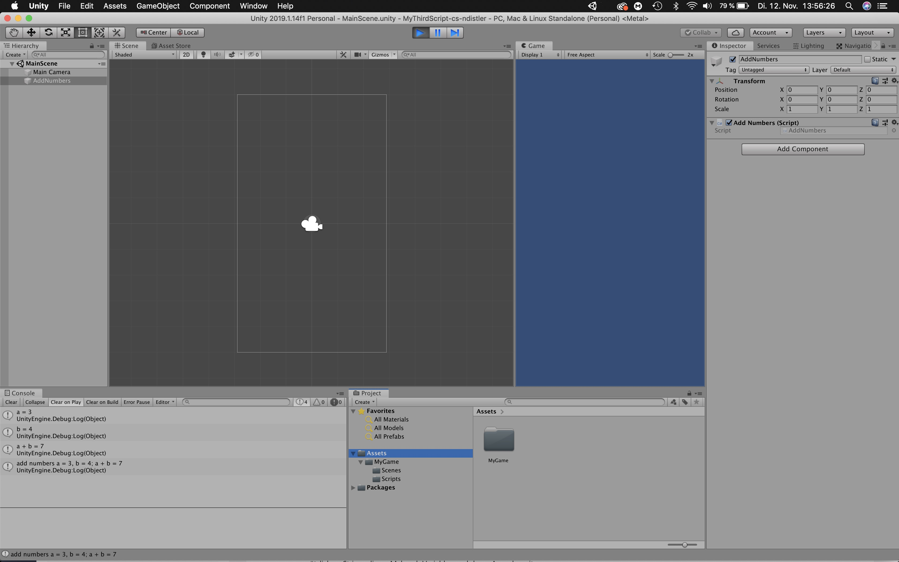

### Title: MyThirdScript-cs-ndistler

### Project Description
Unity Project with a C# Script, to improve the github workflow

### Development platform
Mac OS Mojave, Unity Version 2019.1.14f1, Visual Studio Code Version 1.36.1, Visual Studio Community 2017 for Mac.

### Target platform
WebGL (RefRes: 1280x720 HD-720p)

### Screenshots

### Lessons Learned
I learned how to modify a README.md and improved my github workflow
